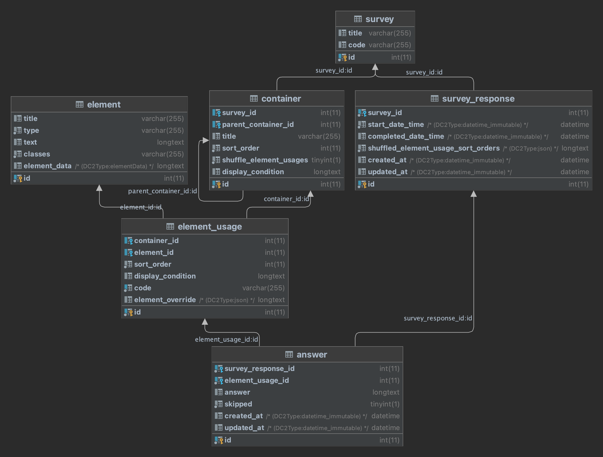

SST Survey Library Bundle
=========================

This bundle provides a library of survey-related Entities and Services for Symfony projects.

# License

This bundle is developed by SST Software, see LICENSE for more details.

# Installation

- Run `composer require sst/surveylib-bundle`
- Create Entities, based on the interfaces in `Interfaces/Entity` (see below)

# Contents

## Entities

This bundle provides interfaces and traits to fulfill these, for a general Survey application.

The bundle assumes that these entities are stored in the `App\Entity\Survey` namespace, if this is not the case, you can change this in the configuration (see below).

Available Entities with their Traits and Interfaces are:

- Survey: The basis of a survey, contains a list of containers
    - Trait: `Sst\SurveyLibBundle\Entity\Traits\SurveyTrait`
    - Interface: `Sst\SurveyLibBundle\Interfaces\Entity\SurveyInterface`
- Container: A container for one or more element-usages or one or more child-containers (use either one, combinations of child-containers and element-usages are not allowed)
    - Trait: `Sst\SurveyLibBundle\Entity\Traits\ContainerTrait`
    - Interface: `Sst\SurveyLibBundle\Interfaces\Entity\ContainerInterface`
- Element: The basis of a survey-element, which can be e.g. a question, or a piece of text.
    - Trait: `Sst\SurveyLibBundle\Entity\Traits\ElementTrait`
    - Interface: `Sst\SurveyLibBundle\Interfaces\Entity\ElementInterface`
- ElementUsage: An element-usage is a reference to an element, which can be used in a container.
    - Trait: `Sst\SurveyLibBundle\Entity\Traits\ElementUsageTrait`
    - Interface: `Sst\SurveyLibBundle\Interfaces\Entity\ElementUsageInterface`
- SurveyResponse: A group of answers, which is the result of a survey being filled in.
    - Trait: `Sst\SurveyLibBundle\Entity\Traits\SurveyResponseTrait`
    - Interface: `Sst\SurveyLibBundle\Interfaces\Entity\SurveyResponseInterface`
- Answer: Contains the given answer to an ElementUsage
    - Trait: `Sst\SurveyLibBundle\Entity\Traits\AnswerTrait`
    - Interface: `Sst\SurveyLibBundle\Interfaces\Entity\AnswerInterface`

### Datamodel



### The Element entity and ElementData

The Element entity has a parameter `elementData`, in which all data regarding the element can be stored.
ElementData matches the `type` of the Element, so make sure you set a valid combination of `type` and `ElementData`when creating an Element

This bundle provides several default ElementData types:

| **ElementType**        | **ElementData**                                | **Description**                                                    |
|------------------------|------------------------------------------------|--------------------------------------------------------------------|
| TEXT                   | TextQuestionElementDataInterface               | Question which can be answered with a  text                        |
| NUMBER                 | NumberQuestionElementDataInterface             | Question which can be answered with a  number                      |
| DATETIME               | DateTimeQuestionElementDataInterface           | Question which can be answered with a  date or datetime            |
| MULTIPLE\_CHOICE       | MultipleChoiceQuestionElementDataInterface     | Multiple choice question                                           |
| MULTIPLE\_CHOICE\_GRID | MultipleChoiceGridQuestionElementDataInterface | Question providing a grid of multiple multiple\-choice\-questions  |
| SCALE                  | ScaleQuestionElementDataInterface              | Question that can be shown as scale                                |
| INFO                   | ElementDataInterface                           | Info\-text, to be shown during a survey                            |
| CUSTOM                 | CustomElementDataInterface                     | Custom ElementData, to allow for project\-specific implementations |

You can extend or overwrite these, as long as your ElementData implements the correct interface, matching the `type` of the Element.

### Display conditions

This bundle provides a service to check if a given ElementUsage should be displayed, based on a given SurveyResponse.  
To identify elements, it uses the `code` parameter of the ElementUsage.  
The provided `displayConditionService` assumes that `ElementUsage->display_condition` contains a valid expression, see [Symfony Expression Language](https://symfony.com/doc/current/components/expression_language.html).  
So make sure, this code is unique in the set you are checking, usually this means, that it should be unique in the related survey.

## Services

This bundle contains several services to use in your survey-project. These are injected automatically when using their interfaces.
This can be overridden by providing a configuration file (see below).

- `createSurveyResponseService`: Creates a new SurveyResponse, linked to the given survey, with stored start-date and shuffled element-order (if applicable)
- `displayConditionService`: Checks if the given ElementUsage should be displayed, based on a given SurveyResponse, also provided functions to get the condition as php or as javascript
- `astToJavascriptService`: Converts an AST to javascript
- `nextElementService`: Gets the next ElementUsage to display for a SurveyResponse, can also be used to get the previous item, by setting `$reverse` to true
- `addAnswerService`: Adds one or more answers to a SurveyResponse, based on the given ElementUsage and the given rawAnswer
- `validateAnswerService`: Validates the given answer for a given ElementUsage

# Customization

You can customize which class implements which interface by providing a configuration file in your project.  
If you want to do so, create a file `config/packages/sst_survey_lib.yaml` with the following contents:

```yaml
sst_survey_lib:
    services:
        createSurveyResponseService: Sst\SurveyLibBundle\Service\CreateSurveyResponseService
        displayConditionService: Sst\SurveyLibBundle\Service\DisplayConditionService
        astToJavascriptService: Sst\SurveyLibBundle\Service\AstToJavascriptService
        nextElementService: Sst\SurveyLibBundle\Service\NextElementService
        addAnswerService: Sst\SurveyLibBundle\Service\AddAnswerService
        validateAnswerService: Sst\SurveyLibBundle\Service\ValidateAnswerService
    entities:
        survey: App\Entity\Survey
        container: App\Entity\Container
        element: App\Entity\Element
        elementOverride: Sst\SurveyLibBundle\Entity\ElementOverride
        elementUsage: App\Entity\ElementUsage
        surveyResponse: App\Entity\SurveyResponse
        answer: App\Entity\Answer
    typeMappings:
        elementData: Sst\SurveyLibBundle\Types\ElementDataType
        rawAnswer: Sst\SurveyLibBundle\Types\RawAnswerType
        elementOverride: Sst\SurveyLibBundle\Types\ElementOverrideType
```

These are the default values, if these are the values you need, you don't need to create the file.
If you need to change this, copy (parts of) above code into this file.

# Events

This bundle provides a few events, which you can listen to.

- `SurveyResponseCreate::PRE_CREATE` is dispatched before a survey-response is created
- `SurveyResponseCreate::POST_CREATE` is dispatched after a survey-response is created

- `AnswerCreate::PRE_CREATE` is dispatched before an answer is created
- `AnswerCreate::POST_CREATE` is dispatched after an answer is created
- `AnswerCreate::PRE_UPDATE` is dispatched before an answer is updated
- `AnswerCreate::POST_UPDATE` is dispatched after an answer is updated
- `AnswerCreate::PRE_VALIDATE` is dispatched before an answer is validated
- `AnswerCreate::POST_VALIDATE` is dispatched after an answer is validated
